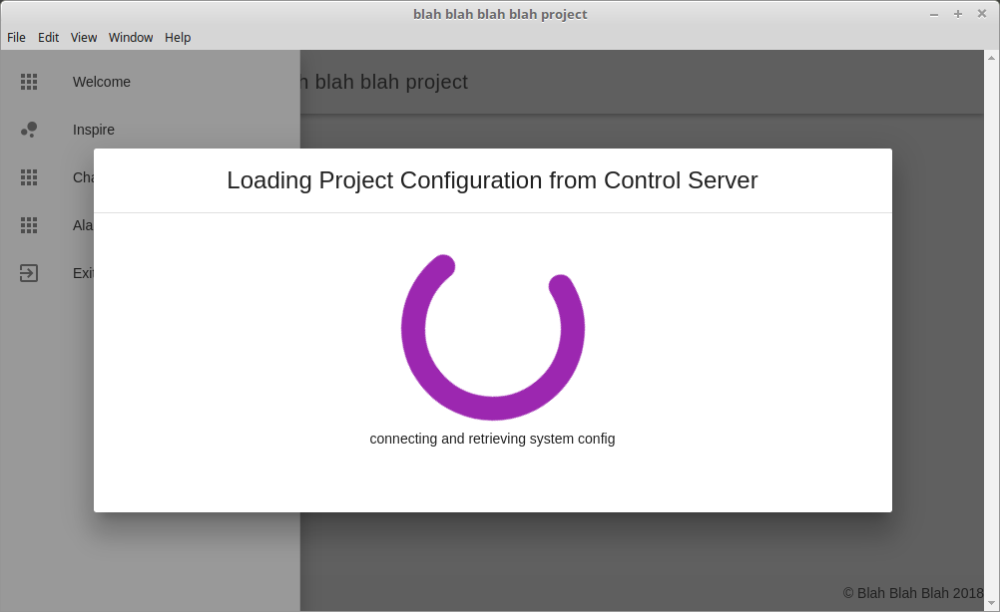
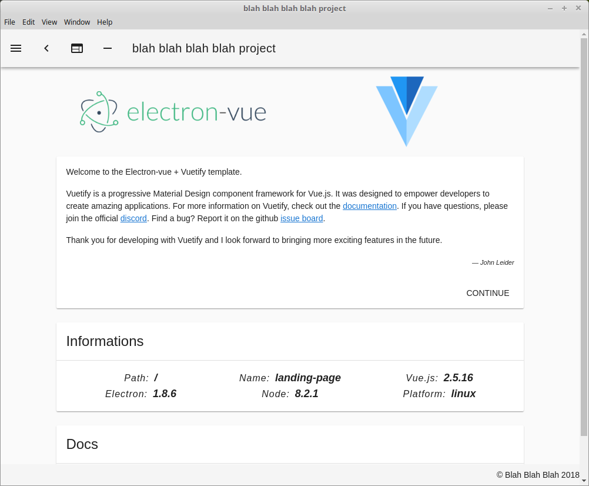
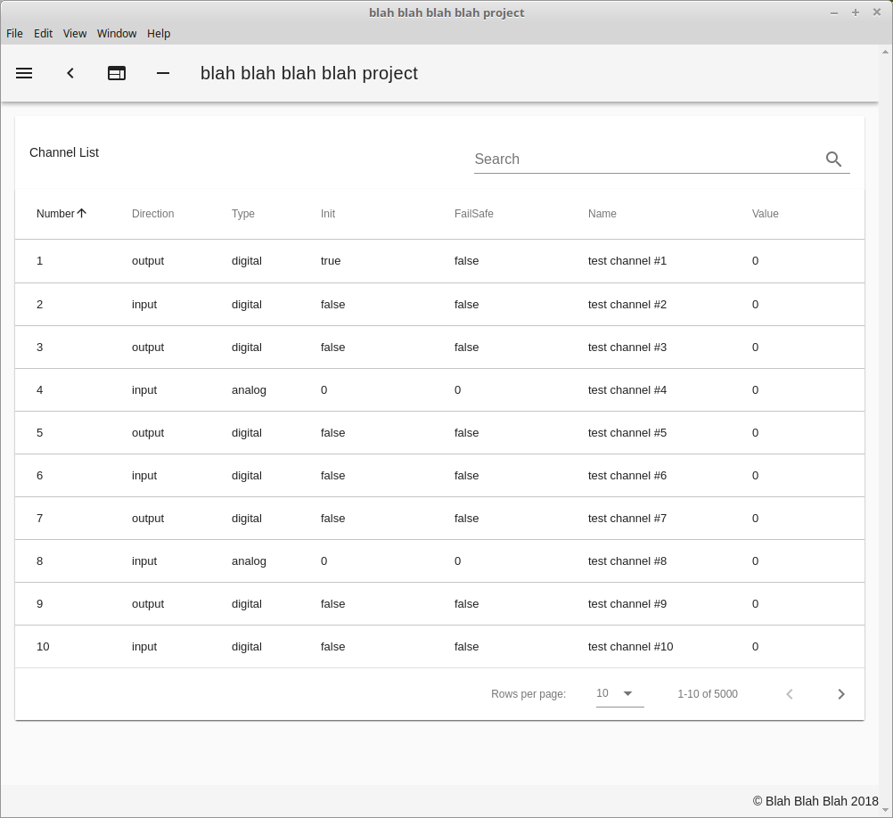
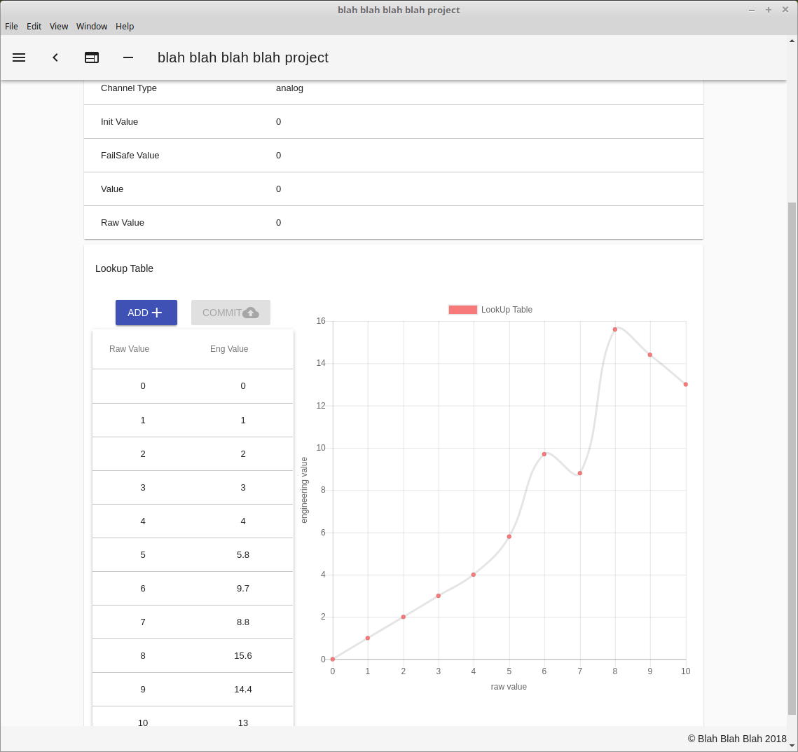
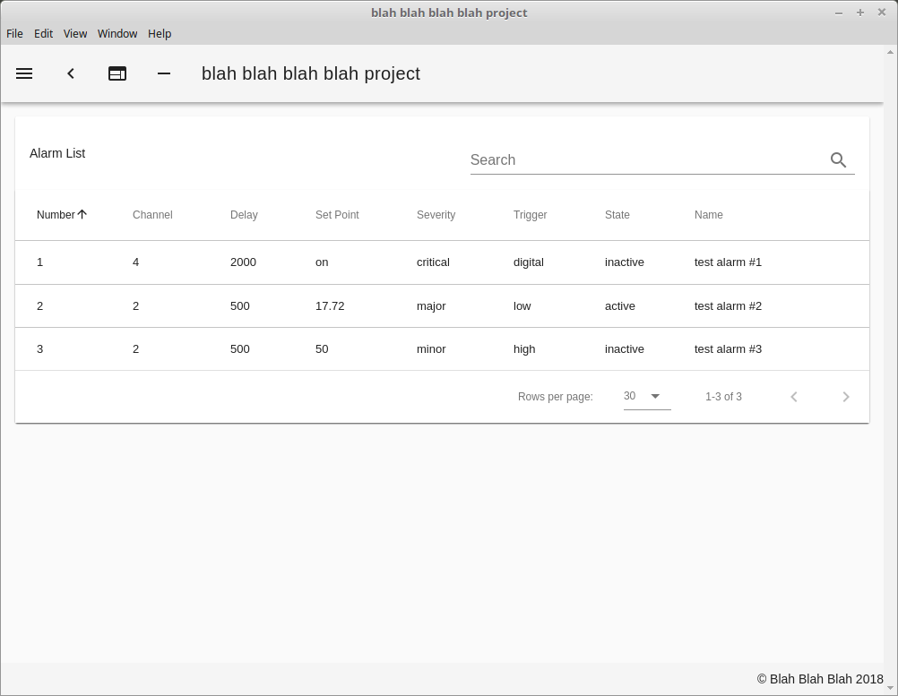
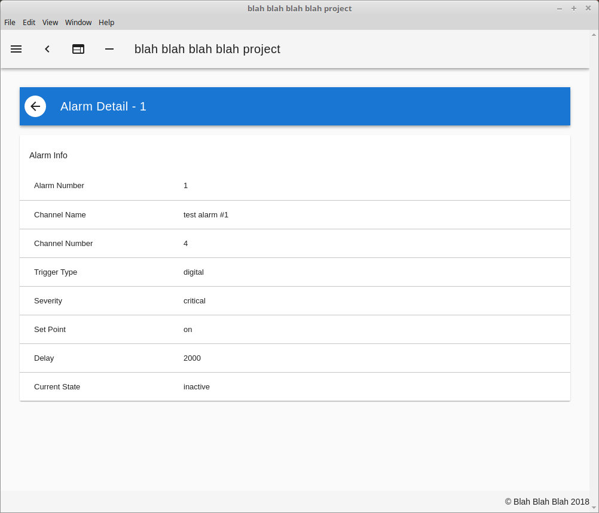
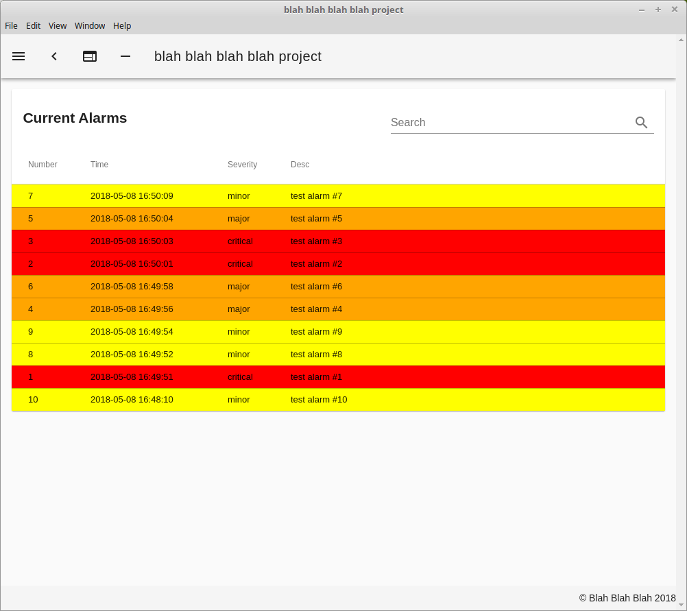

# macron_base

## current status : reaching milestone-2
### Milestone-2

Goals
1. HMI Development
2. HMI integration with Control Server
3. Control Server Base Idea & Functionality Validation/Improvement
4. Control app framework development

### Milestone-1 (Reached on April/26/2018)

1. Generic channel bsaed control/monitoring server.
   * Channels should be loaded from channel configuration database and, should be up and running.
   * Lookup table support for analog channels.
   * Sensor fault detection support.

2. Generic alarm based alarm server.
   * An alarm is associated with a channel.
   * Digital alarm support for digital channels.
   * Analog alarm support for analog channels. Support low/high alarm.
   * Alarm state machine and alarm delay

3. Generic Modbus Master Driver
   * Modbus registers should be mapped to each channel and updated accordingly.
   * Configuraable modbus master request schedule.
   * Multiple concurrent modbus masters via simple configuration.
   * Modbus TCP/RTU support

4. Generic Modbus Slave Driver
   * Modbus registers should be mapped to each channel and alarms, and updated accordingly.
   * Multiple concurrent modbus slaves via simple configuration.
   * Modbus TCP/RTU support

5. CLI (Command Line Interface Support)
   * telnet based CLI support for debugging/configuration/status monitoring/control.
   * Multiple concurrent telnet connection support

6. JSON Web Service support
   * JSON REST API support for status query for channel/alarm/system status
   * JSON REST API support for updating channel/alarm configurations.

7. Runtime configuration update
   * atomic power-fail safe runtime update for core alarm/channel configuration data via CLI/HMI.

8. JSON configuration file
   * Channels are configured on a project basis via JSON system configuration file.
   * Alarms are configured on a project basis via JSON system configuration file.
   * Modbus Masters  are configured on a project basis via JSON system configuration file.
   * Modbus Slaves are configured on a project basis via JSON system configuration file.

9. System architecture
   * Multi-threading support to fully utilize modern multi-core CPU.
   * Event-loop based program structure.

## blah blah blah

library dependencies

core --> modbus
     --> utils 

modbus ---> utils --->  libev
